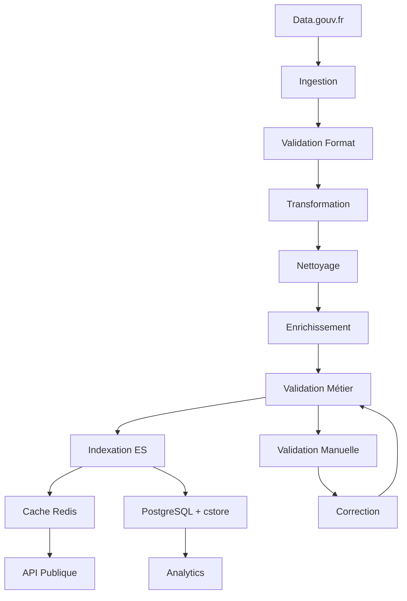

# Pipeline de Données - MatchID

## Vue d'ensemble

Le pipeline de données MatchID est un système complet de traitement qui gère l'ingestion, la transformation, la validation et l'indexation des données depuis Data.gouv.fr jusqu'aux services de recherche et d'appariement. Il utilise une architecture en étapes avec des files d'attente pour assurer la scalabilité et la résilience.

## Architecture du Pipeline

### Flux de Données Global



### Étapes du Pipeline

#### 1. Ingestion des Données
**Source** : Data.gouv.fr API
**Format** : CSV, JSON, XML
**Fréquence** : Quotidienne ou temps réel selon la source

```python
# Ingestion depuis Data.gouv.fr
class DataIngestionService:
    def __init__(self):
        self.datagouv_api = "https://www.data.gouv.fr/api/1/datasets"
        self.supported_formats = ['csv', 'json', 'xml']
    
    async def ingest_dataset(self, dataset_id: str):
        """Ingestion d'un dataset depuis Data.gouv.fr"""
        # Récupération des métadonnées
        metadata = await self.get_dataset_metadata(dataset_id)
        
        # Téléchargement des ressources
        for resource in metadata['resources']:
            if resource['format'].lower() in self.supported_formats:
                await self.download_resource(resource)
                await self.queue_for_processing(resource)
    
    async def download_resource(self, resource):
        """Téléchargement d'une ressource"""
        url = resource['url']
        filename = f"raw/{resource['id']}.{resource['format']}"
        
        async with aiohttp.ClientSession() as session:
            async with session.get(url) as response:
                with open(filename, 'wb') as f:
                    async for chunk in response.content.iter_chunked(8192):
                        f.write(chunk)
```

#### 2. Validation de Format
**Objectif** : Vérifier l'intégrité et la conformité des données
**Outils** : Pandas, Cerberus, JSONSchema

```python
class FormatValidator:
    def __init__(self):
        self.schemas = {
            'deces': {
                'nom': {'type': 'string', 'required': True, 'maxlength': 100},
                'prenom': {'type': 'string', 'required': True, 'maxlength': 100},
                'date_naissance': {'type': 'date', 'required': True},
                'date_deces': {'type': 'date', 'required': True},
                'lieu_naissance': {'type': 'string', 'maxlength': 200},
                'lieu_deces': {'type': 'string', 'maxlength': 200}
            }
        }
    
    def validate_csv(self, filepath: str, schema_name: str):
        """Validation d'un fichier CSV"""
        df = pd.read_csv(filepath)
        schema = self.schemas[schema_name]
        
        errors = []
        
        # Vérification des colonnes requises
        required_cols = [k for k, v in schema.items() if v.get('required')]
        missing_cols = set(required_cols) - set(df.columns)
        if missing_cols:
            errors.append(f"Colonnes manquantes: {missing_cols}")
        
        # Validation ligne par ligne
        for idx, row in df.iterrows():
            row_errors = self.validate_row(row, schema)
            if row_errors:
                errors.append(f"Ligne {idx}: {row_errors}")
        
        return {
            'valid': len(errors) == 0,
            'errors': errors,
            'total_rows': len(df),
            'valid_rows': len(df) - len([e for e in errors if 'Ligne' in e])
        }
```

#### 3. Transformation des Données
**Objectif** : Normalisation et standardisation
**Techniques** : Nettoyage, normalisation, déduplication

```python
class DataTransformer:
    def __init__(self):
        self.name_normalizer = NameNormalizer()
        self.date_parser = DateParser()
        self.location_normalizer = LocationNormalizer()
    
    def transform_person_record(self, record):
        """Transformation d'un enregistrement de personne"""
        transformed = {}
        
        # Normalisation des noms
        transformed['nom'] = self.name_normalizer.normalize(record['nom'])
        transformed['prenom'] = self.name_normalizer.normalize(record['prenom'])
        
        # Parsing des dates
        transformed['date_naissance'] = self.date_parser.parse(record['date_naissance'])
        transformed['date_deces'] = self.date_parser.parse(record['date_deces'])
        
        # Normalisation des lieux
        transformed['lieu_naissance'] = self.location_normalizer.normalize(
            record['lieu_naissance']
        )
        transformed['lieu_deces'] = self.location_normalizer.normalize(
            record['lieu_deces']
        )
        
        # Génération d'identifiants
        transformed['id'] = self.generate_id(transformed)
        transformed['phonetic_nom'] = self.generate_phonetic(transformed['nom'])
        transformed['phonetic_prenom'] = self.generate_phonetic(transformed['prenom'])
        
        return transformed
    
    def generate_phonetic(self, text):
        """Génération de clés phonétiques pour la recherche"""
        # Utilisation de l'algorithme Soundex ou Metaphone
        return soundex(text)
```

#### 4. Enrichissement des Données
**Objectif** : Ajout d'informations contextuelles
**Sources** : Référentiels géographiques, bases INSEE

```python
class DataEnricher:
    def __init__(self):
        self.geo_service = GeographicService()
        self.insee_service = INSEEService()
    
    async def enrich_record(self, record):
        """Enrichissement d'un enregistrement"""
        enriched = record.copy()
        
        # Enrichissement géographique
        if record.get('lieu_naissance'):
            geo_info = await self.geo_service.get_location_info(
                record['lieu_naissance']
            )
            enriched.update({
                'departement_naissance': geo_info.get('departement'),
                'region_naissance': geo_info.get('region'),
                'pays_naissance': geo_info.get('pays', 'France'),
                'coordonnees_naissance': geo_info.get('coordinates')
            })
        
        # Enrichissement démographique
        if record.get('date_naissance'):
            demo_info = self.insee_service.get_demographic_context(
                record['date_naissance']
            )
            enriched.update({
                'generation': demo_info.get('generation'),
                'contexte_historique': demo_info.get('contexte')
            })
        
        return enriched
```

#### 5. Validation Métier
**Objectif** : Vérification de la cohérence métier
**Règles** : Logique métier, contraintes temporelles

```python
class BusinessValidator:
    def __init__(self):
        self.rules = [
            self.validate_dates_coherence,
            self.validate_age_limits,
            self.validate_location_coherence,
            self.validate_name_patterns
        ]
    
    def validate_record(self, record):
        """Validation métier d'un enregistrement"""
        errors = []
        warnings = []
        
        for rule in self.rules:
            result = rule(record)
            if result['errors']:
                errors.extend(result['errors'])
            if result['warnings']:
                warnings.extend(result['warnings'])
        
        return {
            'valid': len(errors) == 0,
            'errors': errors,
            'warnings': warnings
        }
    
    def validate_dates_coherence(self, record):
        """Validation de la cohérence des dates"""
        errors = []
        warnings = []
        
        birth_date = record.get('date_naissance')
        death_date = record.get('date_deces')
        
        if birth_date and death_date:
            if death_date < birth_date:
                errors.append("Date de décès antérieure à la naissance")
            
            age = (death_date - birth_date).days / 365.25
            if age > 120:
                warnings.append(f"Âge au décès très élevé: {age:.0f} ans")
            elif age < 0:
                errors.append("Âge négatif calculé")
        
        return {'errors': errors, 'warnings': warnings}
```

## Indexation et Stockage

### Elasticsearch 8.6.1
**Rôle** : Moteur de recherche principal
**Index** : Structure optimisée pour la recherche

```python
class ElasticsearchIndexer:
    def __init__(self):
        self.es = Elasticsearch([{
            'host': os.getenv('ES_HOST', 'localhost'),
            'port': int(os.getenv('ES_PORT', 9200))
        }])
        self.index_name = 'deces'
    
    async def create_index(self):
        """Création de l'index avec mapping optimisé"""
        mapping = {
            'mappings': {
                'properties': {
                    'nom': {
                        'type': 'text',
                        'analyzer': 'french',
                        'fields': {
                            'keyword': {'type': 'keyword'},
                            'phonetic': {
                                'type': 'text',
                                'analyzer': 'phonetic_analyzer'
                            }
                        }
                    },
                    'prenom': {
                        'type': 'text',
                        'analyzer': 'french',
                        'fields': {
                            'keyword': {'type': 'keyword'},
                            'phonetic': {
                                'type': 'text',
                                'analyzer': 'phonetic_analyzer'
                            }
                        }
                    },
                    'date_naissance': {'type': 'date'},
                    'date_deces': {'type': 'date'},
                    'lieu_naissance': {
                        'type': 'text',
                        'analyzer': 'french'
                    },
                    'lieu_deces': {
                        'type': 'text',
                        'analyzer': 'french'
                    },
                    'coordonnees_naissance': {'type': 'geo_point'},
                    'coordonnees_deces': {'type': 'geo_point'}
                }
            },
            'settings': {
                'analysis': {
                    'analyzer': {
                        'phonetic_analyzer': {
                            'tokenizer': 'standard',
                            'filter': ['lowercase', 'phonetic_filter']
                        }
                    },
                    'filter': {
                        'phonetic_filter': {
                            'type': 'phonetic',
                            'encoder': 'metaphone',
                            'replace': False
                        }
                    }
                }
            }
        }
        
        await self.es.indices.create(
            index=self.index_name,
            body=mapping,
            ignore=400
        )
    
    async def bulk_index(self, records):
        """Indexation en lot"""
        actions = []
        for record in records:
            action = {
                '_index': self.index_name,
                '_id': record['id'],
                '_source': record
            }
            actions.append(action)
        
        await helpers.async_bulk(self.es, actions)
```

### PostgreSQL avec cstore
**Rôle** : Stockage analytique et archivage
**Extension** : cstore_fdw pour le stockage colonnaire

```sql
-- Création de la table principale
CREATE TABLE deces_master (
    id VARCHAR(50) PRIMARY KEY,
    nom VARCHAR(100) NOT NULL,
    prenom VARCHAR(100) NOT NULL,
    date_naissance DATE NOT NULL,
    date_deces DATE NOT NULL,
    lieu_naissance TEXT,
    lieu_deces TEXT,
    departement_naissance VARCHAR(3),
    departement_deces VARCHAR(3),
    created_at TIMESTAMP DEFAULT NOW(),
    updated_at TIMESTAMP DEFAULT NOW()
);

-- Création de la table cstore pour l'analytique
CREATE FOREIGN TABLE deces_analytics (
    annee_deces INTEGER,
    mois_deces INTEGER,
    departement_deces VARCHAR(3),
    age_deces INTEGER,
    count_deces BIGINT
) SERVER cstore_server;

-- Vue matérialisée pour les statistiques
CREATE MATERIALIZED VIEW deces_stats AS
SELECT 
    EXTRACT(YEAR FROM date_deces) as annee,
    EXTRACT(MONTH FROM date_deces) as mois,
    departement_deces,
    COUNT(*) as nb_deces,
    AVG(EXTRACT(YEAR FROM date_deces) - EXTRACT(YEAR FROM date_naissance)) as age_moyen
FROM deces_master
GROUP BY annee, mois, departement_deces;

-- Index pour les recherches fréquentes
CREATE INDEX idx_deces_nom_prenom ON deces_master(nom, prenom);
CREATE INDEX idx_deces_dates ON deces_master(date_naissance, date_deces);
CREATE INDEX idx_deces_lieu ON deces_master(lieu_naissance, lieu_deces);
```

## Files d'Attente et Traitement Asynchrone

### BullMQ avec Redis
**Rôle** : Orchestration des tâches asynchrones
**Queues** : Ingestion, transformation, validation, indexation

```typescript
// Configuration des files d'attente
import { Queue, Worker } from 'bullmq';
import IORedis from 'ioredis';

const connection = new IORedis({
  host: process.env.REDIS_HOST || 'localhost',
  port: parseInt(process.env.REDIS_PORT || '6379')
});

// Files d'attente par étape
export const queues = {
  ingestion: new Queue('data-ingestion', { connection }),
  validation: new Queue('data-validation', { connection }),
  transformation: new Queue('data-transformation', { connection }),
  enrichment: new Queue('data-enrichment', { connection }),
  indexation: new Queue('data-indexation', { connection })
};

// Workers pour chaque étape
export class PipelineWorkers {
  constructor() {
    this.setupWorkers();
  }

  private setupWorkers() {
    // Worker d'ingestion
    new Worker('data-ingestion', async (job) => {
      const { datasetId, resourceUrl } = job.data;
      
      // Téléchargement des données
      const rawData = await this.downloadData(resourceUrl);
      
      // Ajout à la file de validation
      await queues.validation.add('validate-format', {
        datasetId,
        rawData,
        schema: job.data.schema
      });
      
      return { status: 'ingested', recordCount: rawData.length };
    }, { connection });

    // Worker de validation
    new Worker('data-validation', async (job) => {
      const { datasetId, rawData, schema } = job.data;
      
      const validator = new FormatValidator();
      const validationResult = validator.validate(rawData, schema);
      
      if (validationResult.valid) {
        // Ajout à la file de transformation
        await queues.transformation.add('transform-data', {
          datasetId,
          validData: validationResult.validRecords
        });
      }
      
      return validationResult;
    }, { connection });

    // Worker de transformation
    new Worker('data-transformation', async (job) => {
      const { datasetId, validData } = job.data;
      
      const transformer = new DataTransformer();
      const transformedData = await Promise.all(
        validData.map(record => transformer.transform_person_record(record))
      );
      
      // Ajout à la file d'enrichissement
      await queues.enrichment.add('enrich-data', {
        datasetId,
        transformedData
      });
      
      return { status: 'transformed', recordCount: transformedData.length };
    }, { connection });

    // Worker d'enrichissement
    new Worker('data-enrichment', async (job) => {
      const { datasetId, transformedData } = job.data;
      
      const enricher = new DataEnricher();
      const enrichedData = await Promise.all(
        transformedData.map(record => enricher.enrich_record(record))
      );
      
      // Ajout à la file d'indexation
      await queues.indexation.add('index-data', {
        datasetId,
        enrichedData
      });
      
      return { status: 'enriched', recordCount: enrichedData.length };
    }, { connection });

    // Worker d'indexation
    new Worker('data-indexation', async (job) => {
      const { datasetId, enrichedData } = job.data;
      
      // Indexation dans Elasticsearch
      const esIndexer = new ElasticsearchIndexer();
      await esIndexer.bulk_index(enrichedData);
      
      // Sauvegarde dans PostgreSQL
      const pgService = new PostgreSQLService();
      await pgService.bulk_insert(enrichedData);
      
      return { status: 'indexed', recordCount: enrichedData.length };
    }, { connection });
  }
}
```

## Monitoring et Observabilité

### Métriques du Pipeline
```python
class PipelineMetrics:
    def __init__(self):
        self.redis = redis.Redis(host=os.getenv('REDIS_HOST', 'localhost'))
        self.metrics = {
            'records_ingested': 0,
            'records_validated': 0,
            'records_transformed': 0,
            'records_indexed': 0,
            'errors_count': 0,
            'processing_time': {}
        }
    
    def record_stage_completion(self, stage: str, record_count: int, duration: float):
        """Enregistrement des métriques d'une étape"""
        self.metrics[f'records_{stage}'] += record_count
        self.metrics['processing_time'][stage] = duration
        
        # Stockage dans Redis pour monitoring temps réel
        self.redis.hset('pipeline_metrics', stage, record_count)
        self.redis.hset('pipeline_timing', stage, duration)
    
    def get_pipeline_status(self):
        """État actuel du pipeline"""
        return {
            'stages': {
                'ingestion': self.get_queue_status('data-ingestion'),
                'validation': self.get_queue_status('data-validation'),
                'transformation': self.get_queue_status('data-transformation'),
                'enrichment': self.get_queue_status('data-enrichment'),
                'indexation': self.get_queue_status('data-indexation')
            },
            'metrics': self.metrics,
            'health': self.check_pipeline_health()
        }
```

### Dashboard de Monitoring
```typescript
// API pour le dashboard de monitoring
app.get('/api/v1/pipeline/status', async (req, res) => {
  const metrics = new PipelineMetrics();
  const status = await metrics.get_pipeline_status();
  
  res.json({
    timestamp: new Date().toISOString(),
    pipeline: status,
    queues: await getQueueStatistics(),
    elasticsearch: await getElasticsearchHealth(),
    postgresql: await getPostgreSQLHealth()
  });
});

async function getQueueStatistics() {
  const stats = {};
  
  for (const [name, queue] of Object.entries(queues)) {
    stats[name] = {
      waiting: await queue.getWaiting(),
      active: await queue.getActive(),
      completed: await queue.getCompleted(),
      failed: await queue.getFailed()
    };
  }
  
  return stats;
}
```

## Gestion des Erreurs et Reprise

### Stratégie de Retry
```typescript
// Configuration des retry policies
const retryConfig = {
  attempts: 3,
  backoff: {
    type: 'exponential',
    delay: 2000,
  },
  removeOnComplete: 100,
  removeOnFail: 50
};

// Ajout de jobs avec retry
await queues.transformation.add('transform-data', jobData, {
  ...retryConfig,
  priority: job.data.priority || 0
});
```

### Dead Letter Queue
```typescript
// Gestion des échecs définitifs
new Worker('data-transformation', async (job) => {
  try {
    return await processTransformation(job.data);
  } catch (error) {
    if (job.attemptsMade >= 3) {
      // Envoi vers la dead letter queue
      await queues.deadLetter.add('failed-transformation', {
        originalJob: job.data,
        error: error.message,
        attempts: job.attemptsMade
      });
    }
    throw error;
  }
}, { connection });
```

## Performance et Optimisation

### Traitement par Batch
```python
class BatchProcessor:
    def __init__(self, batch_size=1000):
        self.batch_size = batch_size
    
    async def process_large_dataset(self, dataset_path):
        """Traitement par lots d'un gros dataset"""
        total_processed = 0
        
        async for batch in self.read_in_batches(dataset_path):
            # Traitement du batch
            processed_batch = await self.process_batch(batch)
            
            # Indexation du batch
            await self.index_batch(processed_batch)
            
            total_processed += len(processed_batch)
            
            # Mise à jour des métriques
            await self.update_progress(total_processed)
    
    async def read_in_batches(self, filepath):
        """Lecture par chunks d'un fichier CSV"""
        chunk_size = self.batch_size
        for chunk in pd.read_csv(filepath, chunksize=chunk_size):
            yield chunk.to_dict('records')
```

### Cache et Optimisations
```python
class CacheService:
    def __init__(self):
        self.redis = redis.Redis(host=os.getenv('REDIS_HOST', 'localhost'))
        self.cache_ttl = 3600  # 1 heure
    
    async def get_or_compute_enrichment(self, location: str):
        """Cache pour l'enrichissement géographique"""
        cache_key = f"geo_enrichment:{hashlib.md5(location.encode()).hexdigest()}"
        
        # Tentative de récupération du cache
        cached = self.redis.get(cache_key)
        if cached:
            return json.loads(cached)
        
        # Calcul et mise en cache
        enrichment = await self.geo_service.get_location_info(location)
        self.redis.setex(cache_key, self.cache_ttl, json.dumps(enrichment))
        
        return enrichment
```

---

*Ce pipeline de données robuste assure un traitement fiable et scalable des données depuis l'ingestion jusqu'à la mise à disposition via les APIs, avec une architecture résiliente et des capacités de monitoring avancées.*