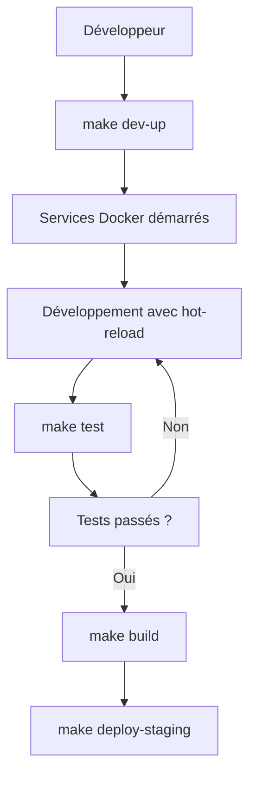
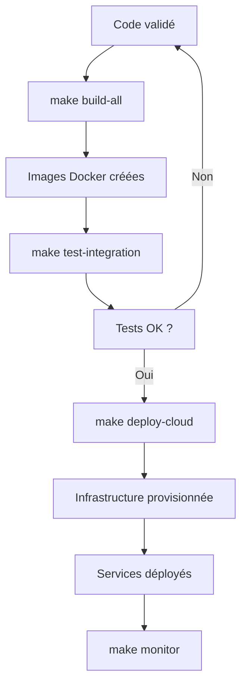

# Orchestration et Automatisation - MatchID

## Vue d'ensemble

MatchID utilise un système d'orchestration sophistiqué basé sur un Makefile central de plus de 700 lignes et un système de configuration par artifacts. Cette architecture permet l'automatisation complète du développement, des tests, du déploiement et de la maintenance sur multiple environnements cloud.

## Makefile Central

### Structure et Organisation

**Localisation** : [`Makefile`](../../Makefile)
**Taille** : 700+ lignes de code
**Rôle** : Orchestrateur principal pour toutes les opérations du projet

#### Sections Principales

##### 1. Configuration et Variables
```makefile
# Variables d'environnement et configuration
include artifacts
export

# Détection automatique de l'environnement
UNAME_S := $(shell uname -s)
DOCKER_COMPOSE := $(shell which docker-compose)
```

##### 2. Gestion des Packages
```makefile
# Packages disponibles
PACKAGES := dataprep-frontend deces-ui website
BACKEND_PACKAGES := dataprep-backend deces-backend

# Cibles pour chaque package
$(PACKAGES): %:
	$(MAKE) -C packages/$@ $(TARGET)
```

##### 3. Développement Local
```makefile
# Démarrage environnement de développement
dev-up:
	docker-compose -f docker-compose-dev.yml up -d

# Arrêt environnement de développement
dev-down:
	docker-compose -f docker-compose-dev.yml down

# Logs en temps réel
dev-logs:
	docker-compose -f docker-compose-dev.yml logs -f
```

##### 4. Build et Tests
```makefile
# Build de tous les packages
build-all:
	$(foreach pkg,$(PACKAGES),$(MAKE) -C packages/$(pkg) build;)

# Tests automatisés
test-all:
	$(foreach pkg,$(PACKAGES),$(MAKE) -C packages/$(pkg) test;)

# Tests d'intégration
test-integration:
	docker-compose -f docker-compose-test.yml up --build --abort-on-container-exit
```

##### 5. Déploiement Cloud
```makefile
# Déploiement multi-cloud
deploy-cloud:
	$(MAKE) cloud-init
	$(MAKE) cloud-deploy
	$(MAKE) cloud-configure

# Support Scaleway, AWS, OpenStack
deploy-scw deploy-aws deploy-ovh:
	CLOUD=$(@:deploy-%=%) $(MAKE) deploy-cloud
```

### Commandes Principales

#### Développement
```bash
# Démarrage rapide
make dev-up

# Build complet
make build-all

# Tests
make test-all

# Nettoyage
make clean
```

#### Déploiement
```bash
# Déploiement Scaleway
make deploy-scw

# Déploiement AWS
make deploy-aws

# Déploiement OpenStack/OVH
make deploy-ovh
```

#### Maintenance
```bash
# Mise à jour des dépendances
make update-deps

# Sauvegarde
make backup

# Monitoring
make monitor
```

## Système d'Artifacts

### Fichier artifacts

**Localisation** : [`artifacts`](../../artifacts)
**Rôle** : Configuration centralisée pour tous les environnements

#### Structure du Fichier
```bash
#!/bin/bash
# Configuration MatchID - Artifacts

# === CONFIGURATION DE BASE ===
export APP_GROUP=matchID
export APP_VERSION=dev
export GIT_ROOT=https://github.com/sebastien-fournier/matchID

# === DOCKER ===
export DOCKER_USERNAME=matchid
export DC_PREFIX=matchid
export DC_NETWORK=matchid

# === SERVICES ===
export ES_VERSION=8.6.1
export POSTGRES_VERSION=13
export REDIS_VERSION=alpine

# === CLOUD PROVIDERS ===
# Scaleway
export SCW_REGION=fr-par
export SCW_PROJECT_ID=${SCW_PROJECT_ID}

# AWS
export AWS_REGION=eu-west-1
export AWS_PROFILE=default

# OpenStack/OVH
export OS_REGION_NAME=GRA7
export OS_AUTH_URL=https://auth.cloud.ovh.net/v3/
```

### Gestion des Environnements

#### Développement Local
```bash
# Configuration minimale
export ENV=development
export PORT=8080
export FRONTEND_DEV_PORT=8081
export DEBUG=true
```

#### Staging
```bash
# Configuration de test
export ENV=staging
export PORT=8080
export DOMAIN=staging.matchid.io
export SSL_ENABLED=true
```

#### Production
```bash
# Configuration production
export ENV=production
export PORT=443
export DOMAIN=matchid.io
export SSL_ENABLED=true
export MONITORING_ENABLED=true
```

## Workflows d'Automatisation

### Workflow de Développement



### Workflow de Déploiement



## Intégrations Cloud

### Scaleway (SCW)
```makefile
# Provisioning d'instance
scw-create-instance:
	scw instance server create \
		type=$(SCW_FLAVOR) \
		image=$(SCW_IMAGE_ID) \
		name=$(APP)-$(ENV)

# Déploiement
scw-deploy:
	$(MAKE) scw-create-instance
	$(MAKE) scw-configure
	$(MAKE) scw-start-services
```

### AWS EC2
```makefile
# Provisioning EC2
aws-create-instance:
	aws ec2 run-instances \
		--image-id $(EC2_IMAGE_ID) \
		--instance-type $(EC2_FLAVOR_TYPE) \
		--key-name $(EC2_KEYPAIR)

# Déploiement
aws-deploy:
	$(MAKE) aws-create-instance
	$(MAKE) aws-configure
	$(MAKE) aws-start-services
```

### OpenStack/OVH
```makefile
# Provisioning OpenStack
os-create-instance:
	openstack server create \
		--flavor $(OS_FLAVOR_ID) \
		--image $(OS_IMAGE_ID) \
		--key-name $(OS_KEYPAIR_NAME) \
		$(APP)-$(ENV)

# Déploiement
os-deploy:
	$(MAKE) os-create-instance
	$(MAKE) os-configure
	$(MAKE) os-start-services
```

## Gestion des Configurations

### Templates de Configuration

#### Docker Compose
```makefile
# Génération des fichiers docker-compose
generate-compose:
	envsubst < docker-compose.template > docker-compose.yml
	envsubst < docker-compose-dev.template > docker-compose-dev.yml
```

#### Nginx
```makefile
# Configuration Nginx
configure-nginx:
	envsubst < nginx/nginx.template > nginx/nginx.conf
	envsubst < nginx/default.template > nginx/default.conf
```

#### Services
```makefile
# Configuration Elasticsearch
configure-es:
	envsubst < config/elasticsearch.template > config/elasticsearch.yml

# Configuration PostgreSQL
configure-postgres:
	envsubst < config/postgres.template > config/postgresql.conf
```

## Monitoring et Maintenance

### Surveillance des Services
```makefile
# Vérification de l'état des services
health-check:
	@echo "Vérification des services..."
	@curl -f http://$(DOMAIN)/health || echo "Frontend KO"
	@curl -f http://$(DOMAIN)/api/v0/health || echo "Backend KO"
	@docker exec $(DC_PREFIX)-elasticsearch curl -f localhost:9200/_cluster/health || echo "ES KO"
```

### Sauvegarde Automatique
```makefile
# Sauvegarde des données
backup:
	@echo "Sauvegarde en cours..."
	docker exec $(DC_PREFIX)-postgres pg_dump -U $(POSTGRES_USER) $(POSTGRES_DB) > backup/postgres-$(shell date +%Y%m%d).sql
	docker exec $(DC_PREFIX)-elasticsearch curl -X POST "localhost:9200/_snapshot/backup/$(shell date +%Y%m%d)"
```

### Mise à Jour des Services
```makefile
# Mise à jour des images Docker
update-images:
	docker pull nginx:$(NGINX_VERSION)
	docker pull postgres:$(POSTGRES_VERSION)
	docker pull elasticsearch:$(ES_VERSION)
	docker pull redis:$(REDIS_VERSION)

# Redémarrage avec nouvelles images
rolling-update:
	$(MAKE) update-images
	docker-compose up -d --force-recreate
```

## Sécurité et Bonnes Pratiques

### Gestion des Secrets
```makefile
# Chiffrement des secrets
encrypt-secrets:
	gpg --cipher-algo AES256 --compress-algo 1 --s2k-cipher-algo AES256 \
		--s2k-digest-algo SHA512 --s2k-mode 3 --s2k-count 65536 \
		--symmetric --output artifacts.gpg artifacts

# Déchiffrement
decrypt-secrets:
	gpg --decrypt artifacts.gpg > artifacts
```

### Validation des Configurations
```makefile
# Validation du fichier artifacts
validate-config:
	@echo "Validation de la configuration..."
	@test -n "$(APP_GROUP)" || (echo "APP_GROUP manquant" && exit 1)
	@test -n "$(ES_VERSION)" || (echo "ES_VERSION manquant" && exit 1)
	@test -n "$(DOCKER_USERNAME)" || (echo "DOCKER_USERNAME manquant" && exit 1)
```

## Extensibilité

### Ajout de Nouveaux Packages
```makefile
# Template pour nouveau package
new-package:
	@read -p "Nom du package: " pkg; \
	mkdir -p packages/$$pkg; \
	cp templates/package-Makefile packages/$$pkg/Makefile; \
	echo "Package $$pkg créé"
```

### Ajout de Nouveaux Providers Cloud
```makefile
# Template pour nouveau provider
new-cloud-provider:
	@read -p "Nom du provider: " provider; \
	cp templates/cloud-provider.mk cloud/$$provider.mk; \
	echo "Provider $$provider ajouté"
```

---

*Ce système d'orchestration permet une gestion unifiée et automatisée de tous les aspects du projet MatchID, du développement local au déploiement multi-cloud en production.*